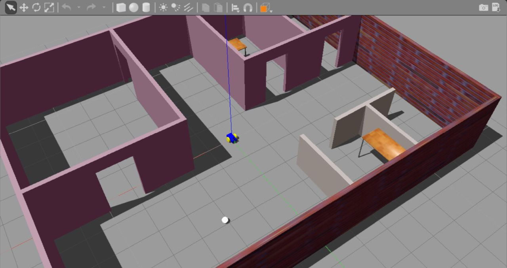
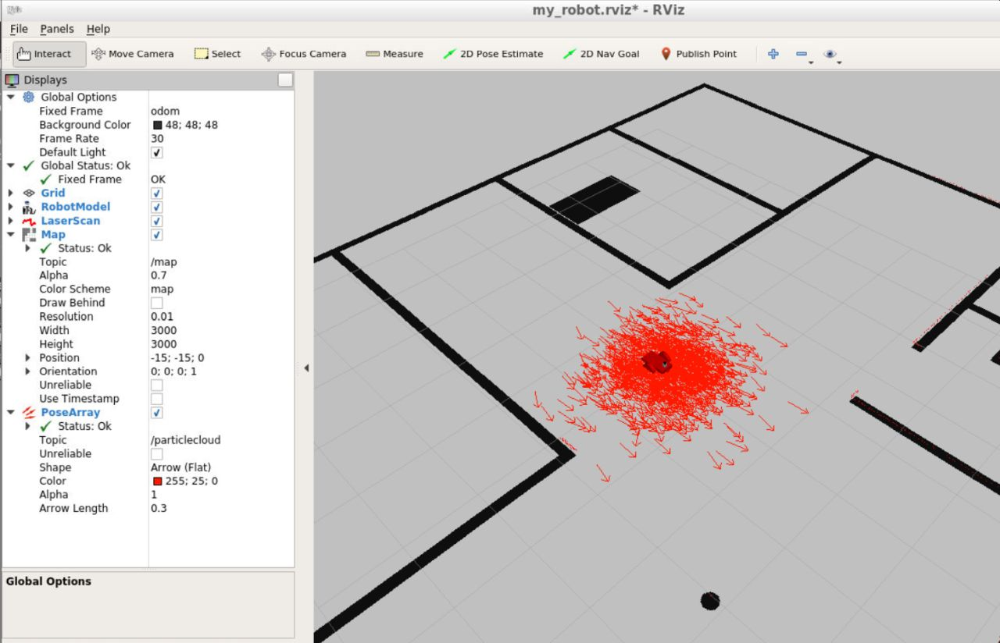
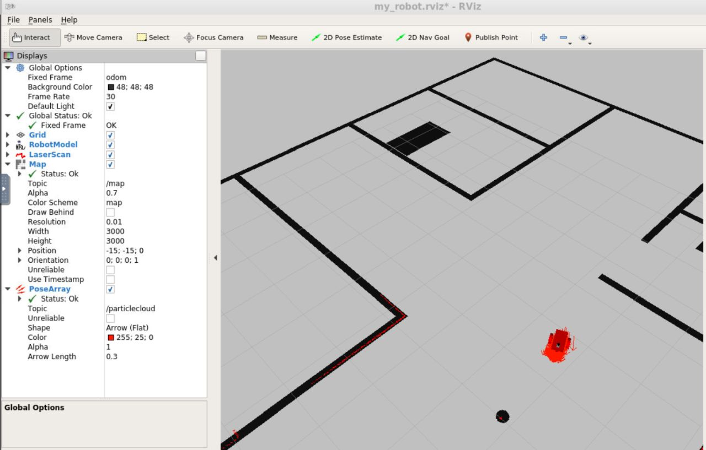

# Robotics_ROS_Monte_Carlo_Localizer

Robot localization within a Gazebo simulated office environment utilizing the [ROS AMCL package](http://wiki.ros.org/amcl). 

Custom ROS package:
- **my_robot**:  Simple robot consisting of 2 rotational wheels and a caster wheel for movement and a LiDAR sensor for sensing.

## Usage

Clone this project into your Catkin workspace's src directory:
`$ cd ~/catkin_ws/src`
`$ git clone https://github.com/jarix/Robotics_ROS_Monte_Carlo_Localizer`

Get ros-teleop package:
`$ git clone https://github.com/ros-teleop/teleop_twist_keyboard`

Build:
`$ cd ~/catkin_ws`
`$ catkin_make`
`$ source devel/setup.bash`

Launch the Robot World (my_robot, Gazebo, and RViz):
`$ roslaunch my_robot world.launch`

Launch AMCL:
`$ roslaunch my_robot amcl.launch`

Control robot with keyboard:
`$ rosrun teleop_twist_keyboard teleop_twist_keyboard.py`

or alternatively send `2D Nav Goal` commands from RViz (button on the toolbar)

## Environment & Dependencies

Developed and tested on ROS Kinetic. Dependencies to the following packages:
```
$ sudo apt-get install ros-kinetic-navigation
$ sudo apt-get install ros-kinetic-map-server
$ sudo apt-get install ros-kinetic-move-base
$ sudo apt-get install ros-kinetic-amcl
```

## Screenshots

### Office Environment in Gazebo


### Unlocalized Robot


### Localized Robot



